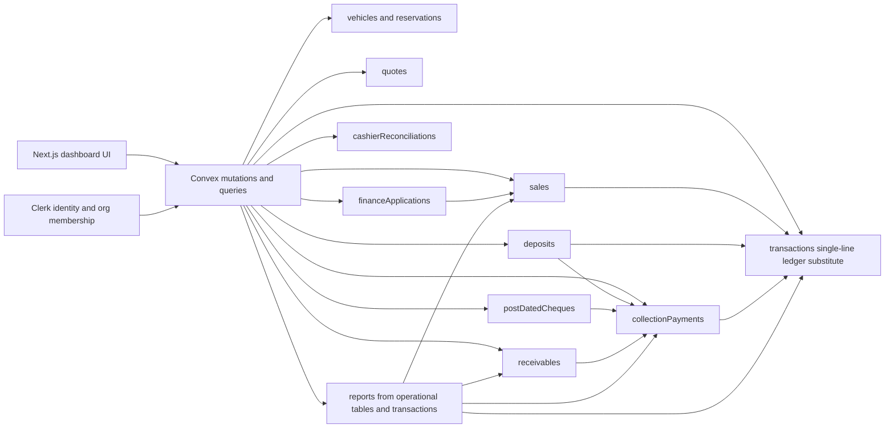
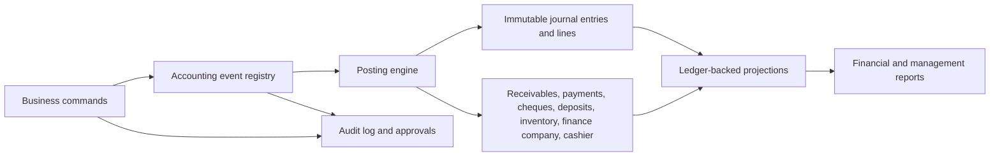

# Finance, Accounting, Collections, and Reporting Architecture Audit

Date: 2026-06-28

Scope: reservations, sales, deposits, refunds, receivables, collections, payment allocation, installments, bank financing, cheques, payment links, transfers, cashier reconciliation, finance applications, GL-like records, inventory accounting, claims, fixed assets, partner equity, commissions, approvals, reports, notifications, audit logs, permissions, and segregation of duties.

This is a static architecture audit. No production code was modified.

Related detailed artifacts:

- [Accounting event matrix](./accounting-event-matrix.md)
- [Report source matrix](./report-source-matrix.md)
- [Remediation roadmap](./remediation-roadmap.md)

## Executive Summary

Final classification: High-risk financial architecture requiring substantial remediation before it can be trusted as an accounting system.

The application has useful dealership operations workflows: vehicles, quotes, sales, deposits, finance applications, receivables, collection payments, cheques, reminders, cashier reconciliation, claims, fixed assets, partner equity, and reports all exist in some form. Convex mutations also provide useful per-mutation atomicity, and org-scoped authorization is present across most server functions.

However, the financial core is not an accounting architecture. It is an operational workflow layer with a mutable single-line `transactions` table used as a ledger substitute. There is no double-entry journal model, no chart of accounts, no journal headers and lines, no balanced postings, no accounting periods, no immutable source-to-ledger event registry, no reversal-first correction model, no payment allocation table, no provider idempotency model, no bank settlement model, and no formal subledger-to-GL reconciliation.

The current system is not safe as the source of truth for financial statements, statutory accounting, investor reporting, bank reconciliation, or high-value collections controls. It can be evolved, but the remediation should be treated as a finance platform rebuild around a posting engine, not as a set of isolated bug fixes.

## Ratings

| Area | Rating | Classification | Summary |
| --- | ---: | --- | --- |
| Overall finance architecture | 3 / 10 | High risk | Operational flows exist, but accounting integrity is not modeled. |
| Accounting integrity | 1 / 10 | Critical | No double-entry ledger, no balanced journals, mutable posted records. |
| Collections and receivables | 4 / 10 | High risk | Basic receivable/payment/cheque workflows exist, but allocation, settlement, and reversals are missing. |
| Finance applications | 3 / 10 | High risk | Approval workflow exists, but financed receivables, disbursements, bank fees, and accounting events are absent. |
| Reporting | 3 / 10 | High risk | Reports mix operational tables and pseudo-ledger data; several reports can silently omit data. |
| Controls and permissions | 4 / 10 | High risk | Broad permissions exist, but segregation of duties and immutable audit controls are incomplete. |
| Scalability | 4 / 10 | Medium-high risk | Several report paths use capped reads, in-memory filters, and N+1 lookups. |
| Test evidence | 3 / 10 | High risk | Some workflow tests exist, but accounting correctness, idempotency, reversals, and controls are largely untested. |

## What Is Working

- Convex mutation atomicity reduces partial-write risk inside a single mutation.
- Most financial functions use `requireTenantAuth`, so org membership and broad permissions are usually checked.
- Core operational entities exist: `sales`, `deposits`, `receivables`, `collectionPayments`, `postDatedCheques`, `cashierReconciliations`, `financeApplications`, `transactions`, `fixedAssets`, `partnerEquity`, and `claims`.
- Collections has separate states for held, deposited, cleared, returned, replaced, and cancelled cheques.
- Some test coverage exists for deposits, sales transaction creation, expense transaction creation, partial payments, and approved refunds.

## Critical Blockers

1. No double-entry general ledger exists.
   - Evidence: `convex/schema.ts` defines `transactions` as a single IN/OUT record with category, amount, date, and description.
   - Impact: the system cannot prove that postings balance, cannot support account-level trial balance, and cannot produce defensible financial statements.

2. Financial posting logic is duplicated across modules.
   - Evidence: deposits, sales helpers, expenses, collections, and manual transactions all insert into `transactions` independently.
   - Impact: different workflow paths post different accounting effects for equivalent business events.

3. Posted financial records are mutable or deletable.
   - Evidence: `convex/transactions.ts` allows update and soft delete; `convex/adminData.ts` allows super-admin arbitrary patch and hard delete across financial tables.
   - Impact: auditability and financial immutability are not enforceable.

4. There is no canonical payment allocation model.
   - Evidence: `collectionPayments.receivableId` links one payment to one receivable; no allocation history table exists.
   - Impact: partial allocations, one payment across many invoices, many payments against one invoice, reversals, unapplied cash, and historical aging cannot be modeled correctly.

5. Sales finalization has inconsistent accounting paths.
   - Evidence: `convex/sales.ts` creates a transaction through `createSaleTransaction`, but `convex/applications.ts` `finalizeDeal` creates a completed sale without creating a sale transaction.
   - Impact: bank-financed or application-finalized sales can bypass accounting.

6. Refunds, cancellations, reschedules, and edits mutate state instead of posting reversals.
   - Evidence: `sales.update` can cancel a sale and restore vehicle availability without reversing the sale transaction; receivable approval handling overwrites due date, outstanding balance, or status.
   - Impact: historical financial truth is overwritten and reports become time-dependent.

7. Payment links and bank transfers are represented as method labels only.
   - Evidence: no payment-provider webhook, payment intent, settlement, fee, or idempotency model was found in `convex/http.ts` or collection flows.
   - Impact: duplicate callbacks, failed settlement, partial settlement, and provider fees cannot be reconciled.

8. Cheque accounting is incomplete.
   - Evidence: collections only post when a cheque clears, but `deposits.create` can accept method `CHEQUE` and post immediately. Cleared cheques cannot later be returned and reopen the receivable.
   - Impact: inconsistent treatment of cheque risk and no full lifecycle accounting.

9. Money is stored as JavaScript `number` and rounded to two decimals.
   - Evidence: financial tables use `v.number()` amounts; `roundMoney` uses `Math.round(amount * 100) / 100`.
   - Impact: precision loss and incorrect minor-unit handling, especially for JOD where three decimal places are expected.

10. Reports are not ledger-backed and can silently misstate results.
    - Evidence: reports read operational tables directly, use capped `.take(500)` or `.take(10000)` patterns, and calculate profit independently.
    - Impact: management reports, accounting reports, and UI totals can diverge.

## Current Architecture Map



## Target Architecture Map



The target model should make operational workflows produce immutable accounting events. The posting engine should map each event to balanced journal lines, subledger updates, and read-model projections. Corrections should be reversals and reposts, not mutable edits.

## Workflow Trace Verdicts

| Workflow | Current verdict | Evidence and consequence |
| --- | --- | --- |
| Reservation deposit | Fragmented | `vehicleReservations` can record a deposit amount without creating a deposit, payment, receivable, or accounting entry. `deposits.create` separately holds the vehicle and posts payment/transaction. |
| Deposit received | High risk | Deposit creation inserts both `transactions` and `collectionPayments`, but no liability account or receivable allocation exists. Cheque deposits can be posted immediately. |
| Deposit applied to sale | Incomplete | `sales.create` resolves deposits as APPLIED and subtracts them from sale transaction amount. No liability reclassification is posted. |
| Deposit refund | Partial | `deposits.release` inserts OUT transaction and refund payment, but no approval workflow is required by the deposit function beyond broad permission. |
| Cash sale | Incomplete | Sale row, vehicle SOLD, and one IN transaction are created. No COGS, inventory relief, tax, receivable, cash account, or journal lines exist. |
| Bank-financed sale | Critical gap | `financeApplications` has status flow, but no approved amount, disbursement, bank receivable, fees, or settlement accounting. `finalizeDeal` bypasses sale transaction creation. |
| Internal installment sale | Partial | Installment receivables can be created and paid, but no schedule table, allocation ledger, interest recognition, or reversal history exists. |
| Cheque collection | Partial | Cheques are held/deposited/cleared, and clearing creates payment/transaction. Returned cleared cheques cannot reopen receivables. |
| Payment link | Not implemented as accounting flow | Method enum exists, but no payment intent, webhook, provider event, idempotency key, fee, or settlement state exists. |
| Bank transfer | Not implemented as verified flow | Transfer method is posted immediately; no pending verification or bank reconciliation model exists. |
| Cashier reconciliation | Operational only | Reconciliation selects payments by cashier/date and patches them. There is no cash drawer session, opening balance, bank deposit, or unique session lifecycle. |
| Sales cancellation | Critical gap | Cancelling a sale restores vehicle status only. It does not reverse transactions, deposit application, receivables, commissions, or inventory effects. |
| Expense lifecycle | High risk | Expense creation posts an OUT transaction even if pending; updates and deletes do not update or reverse the created transaction. |
| Work order expense | High risk | Work orders insert expenses directly and bypass `expenses.create`, so associated transaction posting is skipped. |
| Fixed assets | Incomplete | Asset CRUD exists, but no capitalization, depreciation, disposal, or impairment accounting exists. |
| Partner equity | Incomplete | Partner balances are directly editable; no capital contribution, draw, profit allocation, or ledger exists. |
| Claims | Incomplete | Claims can change status, but no receivable/payable, claim settlement, or payment accounting is generated. |
| Commissions | Incomplete | Sales commission amount and paid marker exist, but no accrual, payable, payment, or clawback accounting exists. |

## Entity Ownership Matrix

| Entity | Current owner | Current source of truth | Accounting impact | Key finding |
| --- | --- | --- | --- | --- |
| `vehicles` | Inventory and sales modules | Operational table | Inventory status and cost basis | Status changes are not tied to inventory accounting. |
| `vehicleReservations` | Reservation functions | Operational table | Potential deposit/hold | Reservation deposit amount is not connected to collections or ledger. |
| `quotes` | Quote functions | Operational table | Pricing proposal | Quote IDs can feed finance applications and deposits; quote creation lacks full org validation for linked entities. |
| `financeApplications` | Finance application functions | Operational table | Bank financing workflow | No finance-company receivable, disbursement, fee, or settlement model. |
| `sales` | Sales functions and finance finalization | Operational table | Revenue and commissions | Multiple sale creation paths produce different accounting effects. |
| `deposits` | Deposit functions | Operational table | Customer deposit liability/cash | Deposit lifecycle is not represented as liability reclassification and settlement. |
| `receivables` | Collections functions | Operational table | Customer balance | Receivable balance is mutable state, not derived from invoices and allocations. |
| `collectionPayments` | Collections and deposits | Operational payment table | Cash/bank/cheque/payment link activity | Payment is linked to at most one receivable; no provider settlement or allocation table. |
| `postDatedCheques` | Collections functions | Cheque instrument table | Conditional collection instrument | Lifecycle lacks returned-after-clear and bank fee accounting. |
| `cashierReconciliations` | Collections functions | Reconciliation table | Cash control | No session lifecycle, opening balance, bank deposit, or uniqueness guard. |
| `transactions` | Many modules plus manual finance UI | Pseudo-ledger | Management cashflow view | Not a GL; mutable, unbalanced, and directly editable. |
| `expenses` | Expenses and work orders | Operational expense table | Expense/cost input | Direct work-order inserts bypass expense posting; updates do not reverse old transactions. |
| `fixedAssets` | Fixed asset functions | Operational asset table | Asset register | No depreciation or capitalization posting. |
| `partnerEquity` | Partner equity functions | Operational balance table | Equity balances | Balance is directly editable. |
| `claims` | Claims functions | Operational claim table | Claim receivable/payable | Status changes are not posted. |
| `adminAuditLog` | Admin tools and impersonation | Admin audit table | Administrative trace | Does not replace immutable financial audit log; admin hard delete remains possible. |

## Accounting Event Summary

The detailed event-by-event matrix is in [accounting-event-matrix.md](./accounting-event-matrix.md). The main conclusion is that most operational events either do not post accounting at all or post into `transactions` without balanced accounts.

Events that currently have some financial posting:

- Deposit received: inserts `deposits`, `collectionPayments`, and `transactions`.
- Deposit refunded: inserts OUT `collectionPayments` and OUT `transactions`.
- Sale created through `sales.create`: inserts one IN `transactions` row.
- Expense created through `expenses.create`: inserts one OUT `transactions` row.
- Collection payment recorded: inserts `collectionPayments`, reduces one receivable, inserts one IN `transactions` row.
- Cheque cleared: inserts `collectionPayments`, reduces one receivable, inserts one IN `transactions` row.
- Approved collection refund: inserts OUT `collectionPayments`, increases receivable balance, inserts OUT `transactions`.

Events that are missing or inconsistent:

- Sale completed through finance application finalization.
- Deposit liability reclassification when applied.
- Sale cancellation reversal.
- Expense update/delete reversal.
- Inventory relief and COGS.
- Finance-company receivable and disbursement.
- Payment link creation, callback, fee, and settlement.
- Bank transfer verification and reconciliation.
- Cheque returned after clearing.
- Commission accrual and payment.
- Fixed asset depreciation/disposal.
- Partner capital/draw posting.
- Claim settlement posting.

## Report Source Summary

The detailed matrix is in [report-source-matrix.md](./report-source-matrix.md). Current reports are not based on a canonical ledger or reconciled projections.

Major reporting concerns:

- Accounting ledger UI reads `transactions`, which is not a GL.
- General ledger tab totals only the currently loaded paginated rows.
- Sales/profit reports calculate profit directly from sales, vehicles, and expenses rather than posted journal lines.
- P&L logic treats many IN categories as revenue and can count deposits or collection payments incorrectly.
- Several reports cap reads at 500, 1000, 5000, or 10000 rows and can silently omit data.
- Some report functions do not consistently filter deleted or cancelled records.
- Collections summary and aging read operational balances directly, not allocation-derived balances.

## Duplicate Logic Report

| Duplicate or divergent logic | Locations | Risk |
| --- | --- | --- |
| Sale creation and finalization | `convex/sales.ts`, `convex/applications.ts` | Application-finalized sale bypasses transaction creation and may bypass sales permissions. |
| Transaction posting | `convex/deposits.ts`, `convex/utils/saleHelpers.ts`, `convex/expenses.ts`, `convex/collections.ts`, `convex/transactions.ts` | No central posting rules, no balanced journals, and inconsistent categories. |
| Expense creation | `convex/expenses.ts`, `convex/workOrders.ts` | Work-order expenses bypass transaction posting. |
| Profit calculation | `convex/reports.ts`, sales commission logic, sales helper logic | Different formulas use purchase price, landed cost, expenses, and sale price differently. |
| Deposit handling | `vehicleReservations`, `deposits`, `sales`, finance finalization | Reservation deposits and quote deposits are separate concepts without reconciliation. |
| Receivable balance updates | Payment, refund approval, cancel approval, reschedule approval | Balance and status are overwritten directly rather than derived from immutable events. |
| Cheque payment treatment | `collections.clearCheque`, `deposits.create` | Collections waits for clearance; deposits can post cheque immediately. |
| Permissions for finance controls | `MANAGE_FINANCE`, `APPROVE_REQUESTS`, owner/admin tools | Broad roles cannot express cashier, approver, bank confirmer, and accountant separation. |
| Reporting sources | Accounting UI, reports page, P&L, collections reports | UI and report totals use different sources and filters. |
| Admin edit/delete | Normal domain functions and `adminData` | Admin patch/hard delete can bypass financial immutability. |

## Risk Register

| ID | Severity | Area | Finding | Business consequence | Recommended control |
| --- | --- | --- | --- | --- | --- |
| R1 | Critical | GL | No double-entry journal model | Financial statements cannot be proven balanced | Add chart of accounts, journal headers, journal lines, and posting engine. |
| R2 | Critical | Immutability | Posted financial records are editable/deletable | Audit trail can be destroyed or rewritten | Make posted records immutable; corrections must be reversals. |
| R3 | Critical | Sales | Finance application finalization bypasses sales posting | Missing revenue/cashflow records | Route all sale completions through one posting command. |
| R4 | Critical | Cancellations | Sale cancellation does not reverse accounting | Overstated revenue and wrong inventory state | Implement reversal events for cancellations. |
| R5 | High | Payments | No idempotency key/provider event model | Duplicate or missing payment posting | Add payment intent, provider event, idempotency, and settlement tables. |
| R6 | High | Allocation | No payment allocation table | Cannot allocate one payment across many receivables or reconstruct history | Add `paymentAllocations` with immutable allocation/reversal rows. |
| R7 | High | Receivables | Outstanding balances are mutable | Aging reports can drift from payment history | Derive balances from invoices, allocations, credits, and reversals. |
| R8 | High | Cheques | Cleared cheques cannot be returned | Returned-bank-item losses cannot be represented | Add cheque reversal/return-after-clear event and bank fee posting. |
| R9 | High | Deposits | Deposit lifecycle lacks liability accounting | Customer deposits can be misclassified as revenue/cashflow | Post deposit received to customer deposits liability; reclassify on sale/refund/forfeit. |
| R10 | High | Currency | Amounts are JS numbers and rounded to 2 decimals | Precision and JOD minor-unit errors | Store money as integer minor units with currency and scale. |
| R11 | High | Reports | Reports use operational tables and capped reads | Financial reports can silently misstate totals | Build ledger-backed projections with explicit reconciliation. |
| R12 | High | Expense lifecycle | Expense updates/deletes do not reverse transaction rows | Expense reports and pseudo-ledger diverge | Route expenses through posting events; lock posted expenses. |
| R13 | High | Admin tools | Super-admin hard delete covers financial tables | Compliance and audit failure | Remove hard delete for financial tables; use tombstones with restricted break-glass workflow. |
| R14 | High | SOD | No self-approval prevention | Fraud/control weakness | Enforce requester != approver and role-specific permissions. |
| R15 | Medium | Scalability | In-memory filters and capped reads in reports | Slow or incomplete reports at scale | Add indexed projections and paginated export/report jobs. |
| R16 | Medium | Validation | Some cross-org linked IDs are not fully validated | Data isolation and integrity risk | Validate every referenced entity belongs to the org before write. |
| R17 | Medium | Cashier | No cash drawer session lifecycle | Cash variances cannot be governed reliably | Add cashier sessions, opening float, expected cash, deposits, and approval states. |
| R18 | Medium | Tests | Missing accounting invariants | Regressions will ship silently | Add posting, idempotency, reversal, allocation, and SOD tests. |

## Gap Analysis Against Top-tier Requirements

| Requirement | Current state | Gap severity |
| --- | --- | --- |
| Double-entry GL | Missing | Critical |
| Chart of accounts | Missing | Critical |
| Journal headers and lines | Missing | Critical |
| Balanced debit/credit validation | Missing | Critical |
| Accounting periods and close locks | Missing | Critical |
| Immutable posted records | Missing | Critical |
| Reversal-first corrections | Missing | Critical |
| Event idempotency | Missing | Critical |
| Payment allocation table | Missing | Critical |
| Provider payment lifecycle | Missing | High |
| Bank transfer verification | Missing | High |
| Cheque full lifecycle | Partial | High |
| Deposit liability accounting | Missing | High |
| Finance-company receivable/disbursement | Missing | High |
| Inventory COGS and relief | Missing | High |
| Tax/VAT handling | Not found | High |
| Cashier session controls | Partial | High |
| Segregation of duties | Partial | High |
| Immutable financial audit log | Partial | High |
| Ledger-backed reports | Missing | High |
| Projection rebuild/reconciliation | Missing | High |
| Multi-currency/minor units | Missing | High |
| Accounting test suite | Partial | High |

## Recommended Target Model

### Core Accounting Tables

- `chartOfAccounts`: account code, name, type, normal balance, org, active flag.
- `accountingPeriods`: period start/end, status OPEN/CLOSING/CLOSED/LOCKED, closed by, closed at.
- `accountingEvents`: source type, source id, event type, event version, org, idempotency key, actor, occurred at, payload hash.
- `journalEntries`: org, period, event id, status, source type/id, memo, posted by, posted at, reversalOf.
- `journalLines`: journal entry id, account id, debit minor units, credit minor units, currency, branch, vehicle/customer/vendor/finance-company dimensions.
- `postingRules`: versioned mapping of business events to journal lines.

### Subledger Tables

- `customerInvoices` or `receivableDocuments`: original source document and due schedule.
- `paymentIntents`: provider, external id, amount, currency, status, expires at.
- `payments`: method, direction, verified status, settlement status, provider event id, bank reference.
- `paymentAllocations`: payment id, receivable id, allocated amount, allocation date, reversal id.
- `customerDeposits`: deposit liability lifecycle with receipt, application, refund, and forfeiture events.
- `chequeInstruments`: drawer, bank, cheque number, received/deposited/cleared/returned dates, fees, replacement links.
- `cashierSessions`: branch, cashier, opening float, opened/closed by, expected cash, counted cash, status.
- `bankDeposits`: cash/cheque/bank-transfer settlement batches.
- `financeCompanyReceivables`: approved amount, financed amount, disbursement, fees, shortfall, settlement.
- `inventoryMovements`: vehicle acquisition, capitalization, cost adjustments, sale relief, reversal.
- `commissionAccruals`: salesperson, sale, accrual, payment, clawback.

### Report Projections

- `trialBalanceProjection`
- `customerAgingProjection`
- `cashierDailyProjection`
- `vehicleProfitProjection`
- `financeCompanyAgingProjection`
- `salesMarginProjection`
- `collectionKpiProjection`

Projections should be rebuildable from immutable events and journal lines. Reports should never calculate official accounting totals directly from mutable operational rows.

## Remediation Strategy

Recommended path: widen, migrate, dual-run, reconcile, switch, then narrow.

1. Stop the bleeding.
   - Freeze arbitrary financial edits.
   - Remove hard delete for financial tables.
   - Add idempotency keys to payment and sale commands.
   - Block self-approval for refunds, cancellations, and reconciliations.

2. Add canonical money and period infrastructure.
   - Store amount as integer minor units plus currency and scale.
   - Add accounting periods and closed-period checks.
   - Introduce chart of accounts.

3. Build a posting engine.
   - One server-side command accepts business events and creates balanced journal lines.
   - All financial modules call this command rather than inserting `transactions` directly.

4. Add payment and allocation subledgers.
   - Separate payment receipt from allocation to receivable.
   - Support unapplied cash, many-to-many allocation, reversals, provider events, and settlement.

5. Migrate high-risk workflows.
   - Sales, deposits, refunds, cheques, bank transfers, payment links, expenses, finance applications, inventory, commissions.

6. Rebuild reports on projections.
   - Create ledger-backed projections and compare against legacy reports during parallel run.

7. Backfill and reconcile.
   - Convert legacy rows to opening balances and historical events where possible.
   - Keep legacy `transactions` as historical/non-authoritative until retired.

The detailed implementation roadmap is in [remediation-roadmap.md](./remediation-roadmap.md).

## Minimum Acceptance Gates Before Production Accounting Use

- Every posted event creates a balanced journal entry.
- Every journal line has currency, minor-unit amount, account, org, period, source event, and immutable audit metadata.
- Every payment has a unique idempotency key or external provider event id.
- Receivable balances are derived from documents, payments, allocations, credits, and reversals.
- Sale cancellation posts reversal entries and restores subledger state through events.
- Expense updates and deletes are disabled after posting; corrections are reversal/repost.
- Payment link and bank transfer flows have pending, verified, failed, settled, and reversed states.
- Cheque returns after clearing are supported with receivable reopening and fee accounting.
- Cashier reconciliation uses sessions and cannot be approved by the cashier who submitted it.
- Closed accounting periods reject new postings except controlled adjustment periods.
- Official financial reports read from ledger-backed projections.
- Tests cover duplicate submission, duplicate provider callbacks, partial allocation, over-allocation prevention, refunds, voids, reversals, period lock, self-approval denial, and report reconciliation.

## Files Inspected

Primary files inspected during this audit:

- `package.json`
- `README.md`
- `convex/_generated/ai/guidelines.md`
- `convex/schema.ts`
- `convex/deposits.ts`
- `convex/utils/depositHelpers.ts`
- `convex/utils/saleHelpers.ts`
- `convex/sales.ts`
- `convex/collections.ts`
- `convex/applications.ts`
- `convex/finance.ts`
- `convex/quotes.ts`
- `convex/reports.ts`
- `convex/transactions.ts`
- `convex/expenses.ts`
- `convex/workOrders.ts`
- `convex/fixedAssets.ts`
- `convex/partnerEquity.ts`
- `convex/claims.ts`
- `convex/adminData.ts`
- `convex/utils/permissions.ts`
- `convex/utils/tenancy.ts`
- `convex/orgSettings.ts`
- `convex/http.ts`
- `convex/crons.ts`
- `convex/utils/dedup.ts`
- `lib/financing.ts`
- `app/(dashboard)/[orgId]/accounting/page.tsx`
- `components/accounting/AccountingClient.tsx`
- `components/accounting/GeneralLedgerTab.tsx`
- `components/accounting/CollectionsTab.tsx`
- `app/(dashboard)/[orgId]/reports/page.tsx`
- Finance-related tests including `convex/collections.test.ts`, `convex/deposits.test.ts`, `convex/expenses.test.ts`, and `convex/sales.test.ts`
- End-to-end test inventory under `testsprite_tests/`

## Commands Run

Representative commands used:

```powershell
Get-Content -Raw C:\Users\123\.codex\attachments\9f2cd0fc-8592-4ad1-8302-d553fdb1dbd3\pasted-text.txt
Get-ChildItem -Force
git status --short
rg --files
rg -n "defineTable|transactions|receivables|collectionPayments|postDatedCheques|cashierReconciliations|financeApplications|deposits" convex
rg -n "insert\\(\"transactions\"|collectionPayments|recordPayment|clearCheque|refund|reconciliation|finalizeDeal|createSaleTransaction" convex
rg -n "useQuery\\(|api\\.reports|api\\.collections|api\\.transactions" app components
Get-Content -Raw convex/_generated/ai/guidelines.md
Get-Content -Raw convex/schema.ts
Get-Content -Raw convex/collections.ts
Get-Content -Raw convex/sales.ts
Get-Content -Raw convex/applications.ts
Get-Content -Raw convex/reports.ts
Get-Content -Raw convex/transactions.ts
```

Some command output was inspected with line numbering to tie findings to exact functions. A few broad search attempts were rerun with narrower patterns after PowerShell quoting made the broad pattern noisy.

## Files Created

- `docs/architecture/finance-accounting-collections-audit.md`
- `docs/architecture/accounting-event-matrix.md`
- `docs/architecture/report-source-matrix.md`
- `docs/architecture/remediation-roadmap.md`

## Files Modified

Documentation files only. No production source files were changed.

## Tests Run

No application test suite was run for this audit pass. This was a read-only architecture and code-path analysis plus documentation creation.

## Missing Evidence and Open Questions

- Statutory accounting requirements, tax/VAT policy, and required financial statement format were not provided.
- The intended chart of accounts and branch/account dimension model were not provided.
- Payment provider, bank transfer provider, and payment link integration requirements were not provided.
- Real production data volumes were not sampled.
- External accounting integration requirements, if any, were not provided.
- Bank reconciliation process, bank account model, and cash deposit process were not provided.
- Inventory costing policy was not provided.
- Commission accrual/payment/clawback policy was not provided.
- Finance company settlement terms, fees, shortfall handling, and disbursement timing were not provided.
- Closed-period policy and audit/compliance requirements were not provided.

## Final Verdict

This system is not yet a top-tier finance/accounting/collections architecture. It is an operational dealership workflow system with partial cashflow tracking.

Recommended next action: do not patch isolated accounting bugs first. Start with a finance remediation foundation: immutable money model, accounting periods, chart of accounts, accounting event registry, posting engine, journal entries/lines, payment allocation subledger, and idempotency. Then migrate workflows one by one behind the new posting layer.
